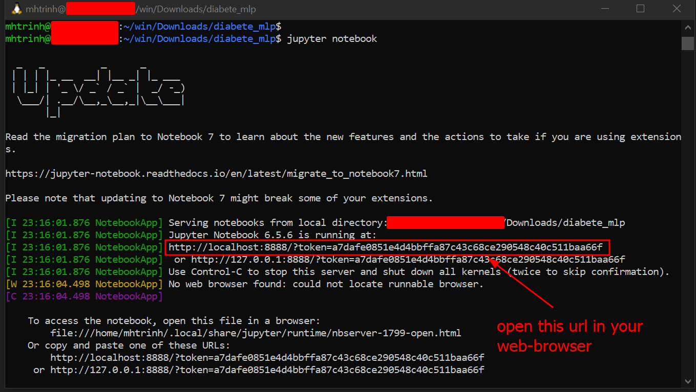

# Deep learning environment
You need:
- Python 3.6 or above
- `pip install <packages>`: `pip` is a package manager for Python (like rpm, apt, ...). You can install python packages via rpm, apt, ... but `pip` give you more choice and most of the time is OS independant.
- `scikit-learn` is a nice python package that have all sort of Machine Learning functions, enough for beginner.

# Step 1: Python
On Window, the simpliest way is to have python inside WSL.

WSL is a Linux inside Windows. The default Linux is Ubuntu that also ship python3.x

Install WSL: https://learn.microsoft.com/en-us/windows/wsl/install

# Step 2: install python packages
Install `python3-pip`:
```
sudo apt-get update
sudo apt-get install python3-pip
```

Install all needed python packages. Note: no `sudo`
```bash
# No sudo
pip3 install --user notebook==6.* pandas scikit-learn matplotlib requests
```
This will automatically install all the dependant packages (like rpm would do)

# Step 3: get this code from github
```
git clone https://github.com/mhtrinh/diabete_mlp
```
This should create a folder named `diabete_mlp` and pull all the code and files in there

# Step 4: start the Jupyter notebook
Run:
```bash
# Go to the code folder
cd diabete_mlp

# Launc jupyter notebook in there
jupyter notebook
```

You should get something like this:


Once you open the given url in your web-browser, click on `diabete_MLP.ipynb` Then execute cell by cell in there.

About Jupyter notebook: this allow you to run one set of code at the time. Each set are inside a "cell". You can run the cells in any  order, rather than just top to bottom. All variable stay in memory across cell run. This feel like running `gdb`'s  `watch` but in better as you can tell what line of code to re-run without re-running the entire code.

In jupyter notebook, "Shift + Enter" to execute a cell

# Setup as standalone python "app" with CLI
This will install all dependencies and provide 2 CLI command:
```
$ trainDiabete --help
usage: trainDiabete [-h] [--testSize TESTSIZE] [-q QUIET] [--layer LAYER] data output

Train model using csv

positional arguments:
  data                  Csv file used to train the model. The last column is used as target.
  output                Path to file to witch the model will be saved.

options:
  -h, --help            show this help message and exit
  --testSize TESTSIZE   Ratio of data to be used as split. Default: 0.100000
  -q QUIET, --quiet QUIET
                        Quiet mode. Do not show stats. Default: False
  --layer LAYER         Define the sizes of hidden layers of the MLP. Default: (10,10,10)
```
```
$ inferenceDiabete --help
usage: inferenceDiabete [-h] model input

Run inference (aka prediction) from trained model

positional arguments:
  model       Path to trained model.
  input       Path to the input csv to run prediction against. The csv can have one or more rows. The column
              order must be the same as the one used to train the model (and excluding the last target column)

options:
  -h, --help  show this help message and exit
```

## Installation
Same as above, the simpliest way in Windows is to have python3 in WSL:
- Install WSL: https://learn.microsoft.com/en-us/windows/wsl/install
- Install `python3-pip`:
```
sudo apt-get update
sudo apt-get install python3-pip
```

Install the package straight from git:
```
pip3 install --user git+https://github.com/mhtrinh/diabete_mlp.git#egg=diabete
```

The command above will install `diabete` package (and all dependencies) and provide 2 CLI above `trainDiabete` and `inferenceDiabete`